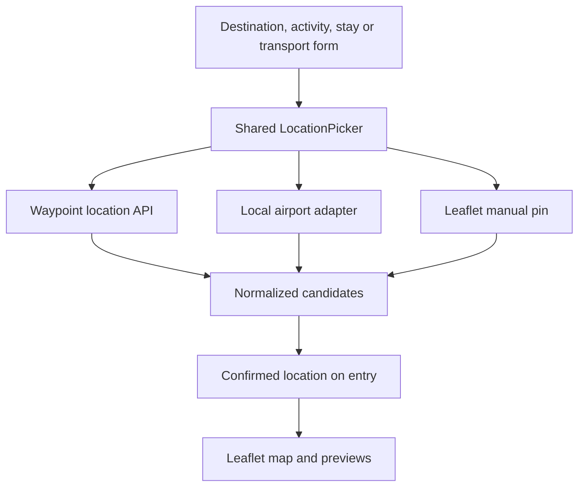
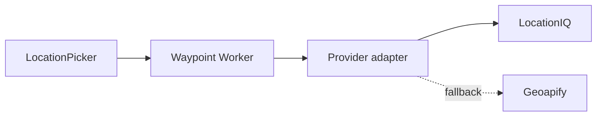

# Waypoint Location and Mapping Plan

**Status:** Core release implemented; follow-on enhancements retained below.

**Updated:** 30 August 2026

**Core decisions:** Keep Leaflet. Make location search explicit and user-triggered. Use one consistent location interface across destinations, activities, accommodation and transport.

## 1. Executive summary

Waypoint does not need a new map renderer to deliver the desired experience. Leaflet already supports markers, lines, layer controls, GeoJSON polygons, popups and automatic bounds. The main problem is that itinerary entries do not consistently store a confirmed location.

The next mapping work should therefore focus on a shared location system:

1. Every place-bearing form uses the same location picker and the same interaction language.
2. The default action is an explicit **Find location** button or Enter key, not automatic type-ahead.
3. Search results, local airport data and manual pin placement are normalized into one location-selection format.
4. Confirmed coordinates are stored on the itinerary entry and reused by Leaflet.
5. Destinations may additionally store a boundary for shaded-area rendering.
6. Manual text and manual pin placement remain available if search is unavailable or incomplete.

This creates a consistent experience for airports, train stations, ports, venues, campsites, hotels, hostels, restaurants, attractions and destinations without forcing every subsection to have identical business fields.

LocationIQ remains the recommended initial hosted search provider, with Geoapify as the preferred fallback. The frontend must not depend on either provider's response shape. A provider-neutral endpoint in the existing Cloudflare Worker will translate results into Waypoint's own contract.

Type-ahead can be added later as an enhancement. It is not required for the architecture or the first release.

### Implementation note — 30 August 2026

This release now includes the shared picker in destination, activity,
accommodation and transport forms; explicit Worker-backed search; local
airport results; manual pins; persisted record coordinates; KV-backed
destination boundaries; the Leaflet area/pin/transport layers; and the
Map-tab day stepper. It deliberately excludes offline maps, type-ahead,
automatic migration of old query-cache locations, and approximate
bounding-box shading.

## 2. Product principles

### Leaflet is the committed renderer

This plan does not include a MapLibre, Mapbox, OpenLayers or Google Maps migration. Leaflet will continue to render:

- destination areas and fallback pins;
- activity and accommodation markers;
- transport endpoints and connecting lines;
- popups, filters and automatic map bounds;
- manual-pin and boundary previews inside forms.

Tile choice remains independent from Leaflet. The current OpenStreetMap raster basemap can remain in place and may be restyled or replaced later without rewriting the location workflow.

### Search is deliberate, not continuous

The primary workflow is:

1. Enter a venue, address, destination or transport hub.
2. Select **Find location**, or press Enter.
3. Review a short result list.
4. Select and confirm the correct result.

This avoids sending a request for every partial phrase, makes quota use predictable and works well on mobile. It also permits complete queries such as `Oakland Marriott City Center` or `King's Cross Station`.

Optional type-ahead may be introduced later behind a configuration flag. If enabled, it should begin after three characters, wait approximately 400 ms after typing stops and cancel superseded requests. These are optimization rules for the optional mode, not requirements for the core picker.

### Consistency means a shared pattern

All location-bearing subsections must share:

- the same field labels and button names;
- the same result-row structure;
- the same selected-location summary;
- the same mapped, manually pinned and unmapped states;
- the same change, clear and manual-pin actions;
- the same loading, empty, offline and quota messages;
- the same Leaflet confirmation preview where a preview is needed;
- keyboard, touch and screen-reader behaviour.

Context may influence ranking and extra metadata, but must not create a different search interface for each subsection.

## 3. Scope

### Required outcomes

- Search by place name or address for activities and accommodation.
- Search transport hubs including airports, stations, ports and bus terminals.
- Resolve destinations as geographic entities and shade their boundaries where usable geometry exists.
- Save confirmed coordinates directly with each entry.
- Continue to display all information available on the current map.
- Provide manual address and manual pin fallbacks.
- Operate within free provider allowances, with a hard failure rather than surprise billing.
- Keep provider credentials out of the public repository.

### Non-goals

- Replacing Leaflet.
- Turn-by-turn navigation or route planning.
- Automatically resolving every historical record.
- Requiring type-ahead search.
- Self-hosting a global geocoder in the first release.
- Guaranteeing an exact boundary for every colloquial or loosely defined destination.
- Replacing the transport, activity or accommodation domain models with a universal place record.

## 4. Original-state problems

Before this release, the application used:

- vendored Leaflet in `public/WayPoint/vendor/leaflet/`;
- OpenStreetMap raster tiles;
- direct browser calls to public Nominatim;
- a trip-level `geocodeCache` keyed by query text;
- local airport data and AeroDataBox for some flight endpoints;
- separate map layers for destinations, activities, accommodation and transport.

The weaknesses are primarily data and workflow problems:

- coordinates are often guessed only when the Map tab opens;
- the user does not confirm whether a result is correct;
- public Nominatim is not intended for client-side autocomplete;
- query-cache coordinates are not attached to the record they describe;
- destinations are represented as pins even when they are geographic areas;
- each subsection has different location concepts and controls;
- direct browser integration makes providers difficult to change and exposes operational details.

## 5. Consistent location-picker experience

### Standard component

Create one reusable `LocationPicker` used by all forms. Its standard presentation is:

```text
Location
[ Venue, address, destination or transport hub        ]
[ Find location ]

Selected location
Place name
Formatted address
[ View on map ] [ Change ] [ Clear ]

[ Use typed location ] [ Set pin manually ]
```

The picker has a small number of explicit states:

| State | Presentation | Permitted actions |
| --- | --- | --- |
| Empty | Input, Find location, manual-pin action | Type, search or place a pin |
| Searching | Input retained, progress indicator | Cancel or wait |
| Results | Consistent result rows | Select, refine search, use typed text or pin manually |
| Selected | Name, address and mapping status | Preview, change or clear |
| Manual pin | User label/address plus coordinates | Preview, move or clear pin |
| Typed only | User text marked `Unmapped` | Save, search again or add pin |
| Error/offline/quota | Plain-language status | Retry, use typed text or add pin |

### Standard result row

Every source must produce the same visible result structure:

```text
Primary name                         Type
Formatted address or geographic hierarchy
```

Examples:

```text
The Met Cloisters                    Museum
99 Margaret Corbin Drive, New York, NY, United States

King's Cross St Pancras              Railway station
London, England, United Kingdom

New York                             State
United States
```

The type label is important for disambiguating venues from neighbourhoods, cities from states and airports from similarly named places.

### Form-specific composition

The shared picker is composed into each form rather than copied and modified:

| Subsection | Existing domain fields | Location-picker context | Additional behaviour |
| --- | --- | --- | --- |
| Destination | Name, country, dates | `destination` | May fetch and preview a boundary after selection |
| Activity | Name, category, date/time | `activity` | Bias toward venues, attractions, dining and the selected destination |
| Accommodation | Name, type, dates | `accommodation` | Bias toward hotel/hostel, campsite, rental and other stays |
| Flight endpoint | Airport name/code | `airport` | Search local IATA dataset first; provider results appear in the same UI |
| Train endpoint | Station name | `rail` | Bias toward railway and metro stations |
| Bus endpoint | Stop or terminal | `bus` | Bias toward bus stations and terminals |
| Ferry/cruise endpoint | Port or terminal | `port` | Bias toward ports, ferry terminals and cruise terminals |
| Other transport endpoint | Place or address | `transport` | Broad place/address ranking |

Flight fields may continue to expose IATA codes and airport-specific details, but selection, confirmation, mapping status and error behaviour must remain consistent with all other subsections.

### Progressive disclosure

The form should not show a map or provider details by default.

- Initially show the location input and **Find location**.
- Show results only after the user searches.
- Show the compact selected-location summary after selection.
- Open the Leaflet preview only when the user chooses **View on map**, **Set pin manually**, or needs to confirm a destination boundary.
- Keep latitude, longitude, source identifiers and geometry out of the normal UI.

This keeps new-entry forms compact while retaining precision controls when they are useful.

## 6. Shared frontend architecture



### Component responsibilities

`LocationPicker` owns:

- the input, search action and result list;
- selection and confirmation state;
- keyboard and touch interaction;
- manual text and manual pin alternatives;
- standard status and error messages;
- emission of a normalized selected location.

Context adapters own:

- ranking hints and allowed place categories;
- local airport matching;
- destination boundary eligibility;
- optional display metadata such as IATA code.

The parent form owns:

- domain fields such as date, category, accommodation type and booking data;
- deciding whether the picker represents one location or a From/To endpoint;
- saving the normalized selection using the relevant record fields.

### One component, two transport endpoints

Transport should use the same picker twice, once for **From** and once for **To**. A transport-mode context changes ranking but not the component. This prevents separate airport, railway, bus and port widgets from drifting into inconsistent behaviour.

## 7. Provider-neutral location service

The browser must call the existing authenticated Cloudflare Worker rather than a geocoding provider directly.



The Worker owns authentication, secret storage, validation, provider translation, timeouts, rate controls and attribution metadata. The frontend consumes only Waypoint's normalized response.

### `GET /WayPoint/api/location-search`

This endpoint supports explicit searches. It does not assume autocomplete.

| Parameter | Rules | Purpose |
| --- | --- | --- |
| `q` | Required; 2-200 characters | Complete or partial user-entered query |
| `context` | Allowlisted location context | Tunes ranking without excluding unusual results |
| `lat`, `lng` | Optional valid coordinates | Biases results toward the selected destination |
| `country` | Optional two-letter code | Reduces global ambiguity |
| `limit` | Server-controlled maximum of 6 | Limits payload and quota use |

Example normalized response:

```json
{
  "results": [
    {
      "source": "locationiq",
      "sourceId": "R123456",
      "osmType": "relation",
      "osmId": "123456",
      "name": "Dartmoor National Park",
      "formattedAddress": "Dartmoor National Park, Devon, England, United Kingdom",
      "kind": "protected_area",
      "lat": 50.5719,
      "lng": -3.9207,
      "bbox": [-4.2, 50.3, -3.6, 50.8],
      "canRequestBoundary": true
    }
  ],
  "attribution": {
    "label": "Search by LocationIQ.com",
    "url": "https://locationiq.com/"
  }
}
```

The Worker must construct this object field by field and must not relay arbitrary upstream HTML or properties.

### Local airport results

The existing airport/IATA resolver should be wrapped in a frontend adapter that produces the same candidate structure as the Worker. Local airport matches can be placed above remote results. If the local result is sufficient, no provider call is required.

### `GET /WayPoint/api/location-boundary`

Call this endpoint only after the user selects a destination candidate that advertises boundary support. Accept an allowlisted OSM type and positive OSM ID, then return sanitized `Polygon` or `MultiPolygon` GeoJSON.

If an exact usable polygon is unavailable, return a clearly marked bounding-box approximation or no boundary. The UI must not describe an approximate box as an exact destination boundary.

### Stable errors

| HTTP | Code | Picker behaviour |
| --- | --- | --- |
| 400 | `INVALID_QUERY` | Retain text and explain the correction |
| 401/403 | Existing auth errors | Use the established login/permission flow |
| 404 | `NO_RESULTS` / `NO_BOUNDARY` | Offer typed text or manual pin |
| 429 | `LOCATION_QUOTA_REACHED` | Stop requests; retain manual options |
| 502 | `LOCATION_PROVIDER_UNAVAILABLE` | Offer retry and manual options |
| 504 | `LOCATION_PROVIDER_TIMEOUT` | Offer retry without an indefinite spinner |

## 8. Provider choice

| Option | Free allowance and capability | Fit for Waypoint |
| --- | --- | --- |
| **LocationIQ** | Hosted OSM search, POIs, addresses, OSM identifiers and simplified polygons; selected fields may be stored subject to its terms | **Recommended initial provider.** Closest to the current Nominatim-shaped integration |
| **Geoapify** | Hosted autocomplete/geocoding, POIs, place details and boundaries; storage permitted subject to attribution | **Preferred fallback.** Clean API family and provider diversity |
| **Public Nominatim** | Appropriate for moderate user-triggered search, but not client-side autocomplete or heavy production use | Emergency/manual-search fallback only |
| **Self-hosted Photon/Pelias** | Open-source software but requires infrastructure and data operations | Not practically free for this release |
| **Mapbox/Google** | Strong search ecosystems with usage allowances | Rejected because permanent zero-cost operation is not assured and durable result terms are less suitable |

Provider quotas, prices and terms must be checked again during implementation. No hosted provider can be assumed to remain free indefinitely, which is why typed locations, local airport matching and manual pin placement are first-class paths.

## 9. Stored location contract

All sources should produce the following conceptual selection before it is written to an entry:

```text
label
formattedAddress
lat, lng
kind
source
sourceId
precision             selected | manual | legacy_cache | unmapped
bbox                   optional
boundaryGeometry       destination only, optional
boundaryQuality        exact_simplified | approximate_bbox | none
```

To minimize migration risk, the first implementation may serialize these values into the existing flat record shapes rather than introducing a nested object everywhere.

### Activities and accommodation

Add:

```text
lat, lng
locationRef
locationKindLabel
locationMethod
locationGranularity
locationStale
```

Retain existing user-facing name, location and address fields.

### Destinations

Add:

```text
lat, lng
locationRef
locationKindLabel
locationMethod
locationGranularity
bbox
boundaryRef
boundaryQuality
```

### Transport

Retain `fromLat`, `fromLng`, `toLat` and `toLng`, and add `from`/`to` versions of `LocationRef`, `LocationKindLabel`, `LocationMethod`, `LocationGranularity` and `LocationStale`. Flight endpoints may also retain IATA-specific fields.

### Invalidation rule

If the user materially edits the visible location text after confirming a result, the picker must mark the saved selection as needing reconfirmation. It must never silently keep coordinates for a place the text no longer describes.

## 10. Geometry safety

The Worker must:

- accept only GeoJSON `Polygon` and `MultiPolygon` geometry;
- validate all coordinates and legal longitude/latitude ranges;
- cap nesting, ring count, coordinate count and serialized size;
- reject unknown and prototype-sensitive properties;
- simplify or fall back to a bounding box when necessary;
- preserve the existing total trip-payload limit as a final guard.

An initial storage limit of 250 KB and at most 10,000 coordinate positions per destination is reasonable, but must be tested using New York City, New York State and Dartmoor fixtures.

## 11. Leaflet behaviour

### Entry previews

Use a small Leaflet instance for manual pin placement and destination-boundary confirmation. Reuse the same preview component wherever it appears.

### Main Map tab

1. Render coordinates stored on entries first.
2. Do not contact a geocoder just because the Map tab opened; old `geocodeCache` records are not automatically promoted or drawn.
3. Surface unresolved entries in the map status with a prompt to select a location or set a pin.
4. Render destination geometry with `L.geoJSON`.
5. Use a pin when no usable boundary is available.
6. Preserve activity, accommodation and transport layers and toggles.
7. Include points and polygon bounds in `fitBounds`.
8. Keep destination shading muted enough for roads, labels and point markers to remain legible.
9. Use consistent popup labels and context across marker types.

The map remains a view of saved itinerary data, not the place where missing data is silently guessed.

## 12. Quota, caching and offline behaviour

### Default explicit-search mode

- One request per Find location action or Enter press.
- Prevent duplicate submissions while a request is active.
- Cancel the active request if the query or context changes.
- Return no more than six results.
- Perform one boundary lookup only after destination selection.
- Never retry `429` automatically.
- Use a short Worker timeout, approximately five seconds.
- Apply a best-effort per-account limiter to catch accidental loops (implemented as 36 provider requests per account per 15 minutes; cached boundary reads do not consume a slot).

### Optional future type-ahead mode

If later enabled:

- begin after three characters;
- debounce for approximately 400 ms;
- cancel superseded requests with `AbortController`;
- retain the explicit Find location action as an accessible fallback.

### Cache design

- Use Cloudflare's Cache API for normalized search responses with a short, provider-compliant TTL.
- Do not write each search response to Waypoint KV.
- Save only the user's selected normalized fields and boundary on the trip.
- Keep any full upstream response cache within provider terms.
- Preserve source attribution with durable data where required.

When quota is exhausted or the provider is unavailable, already mapped trips remain fully usable, and users can still save typed locations or manual pins.

## 13. Security and privacy

- Store provider keys as Cloudflare Worker secrets, never in frontend code, `wrangler.toml`, committed tests or documentation examples.
- Require a valid Waypoint session for location endpoints.
- Use fixed upstream URLs and allowlisted contexts.
- Validate query length, coordinates, country codes, identifiers and response sizes.
- Normalize all upstream data and escape visible labels through the existing safe-rendering path.
- Send only the location query and optional coarse geographic bias.
- Never send trip names, companions, notes, booking references or unrelated trip data.
- Avoid logging full queries because they may contain private accommodation addresses.
- Display the required provider and OpenStreetMap attribution consistently.

## 14. Compatibility and migration

No destructive migration is required.

- All new record fields are optional.
- Existing `geocodeCache` remains stored for compatibility but is not automatically drawn or promoted.
- Editing an old entry through the shared picker attaches confirmed coordinates to that entry.
- A legacy cache result is never silently promoted to a user-confirmed selection.
- Destinations without geometry continue to render as a point.
- Export/import and Worker sanitizers must include the new allowlisted fields.
- Existing role and edit permissions remain authoritative when saving locations.
- Direct browser geocoding should be disabled for new lookups, then removed after legacy reliance is low.

## 15. Delivery plan

### Release 1 — Shared location foundation

- Define the normalized location candidate and selection contracts.
- Build the shared `LocationPicker`, standard result row, status messages and selected summary.
- Build a reusable Leaflet preview/manual-pin component.
- Add the provider-neutral Worker adapter and authenticated explicit-search endpoint.
- Wrap the existing airport dataset in the normalized candidate adapter.
- Extend Worker allowlists, trip sanitization and export/import fields.
- Add provider secrets and attribution documentation.

**Exit criterion:** the same picker can select, manually pin and save a location in a test harness using both local and provider candidates.

### Release 2 — Activities and accommodation

- Integrate the shared picker into activity forms.
- Integrate the identical picker into accommodation forms, including campsites and hotel/hostel entries.
- Bias results toward the selected destination.
- Store confirmed coordinates on each record.
- Display consistent `Mapped`, `Manual pin` and `Unmapped` states.

**Exit criterion:** a venue, campsite and hotel/hostel can each be created, reopened and mapped without another provider request.

### Release 3 — Transport hubs

- Use the shared picker for From and To endpoints.
- Preserve local airport/IATA resolution while presenting it through the common interface.
- Add context ranking for rail, bus and port modes.
- Store coordinates and provenance independently for both endpoints.

**Exit criterion:** airport, station and port selection have the same interaction pattern and consistently render on the Map tab.

### Release 4 — Destination areas

- Integrate the shared picker into destination forms.
- Display geographic type clearly for disambiguation.
- Add boundary lookup, geometry validation and Leaflet confirmation preview.
- Render exact simplified areas, approximate boxes or fallback pins with honest semantics.

**Exit criterion:** New York City, New York State and Dartmoor National Park can be distinguished and render the selected area where provider geometry supports it.

### Release 5 — Map UX polish and optional type-ahead

- Improve marker/pop-up consistency and entry focus actions.
- Refine layer filters and unresolved-location messaging.
- Validate mobile form and map ergonomics.
- Add clustering only if real trip density warrants it.
- Consider optional type-ahead only after measuring whether explicit search causes meaningful friction.

**Exit criterion:** location selection and correction feel like one coherent Waypoint feature across every subsection.

## 16. Testing strategy

### Shared picker tests

- identical state transitions in every parent form;
- button and Enter-key submission;
- duplicate submission prevention and cancellation;
- keyboard, touch and screen-reader result selection;
- consistent result ordering and rendering from local and remote adapters;
- selection persistence when reopening an entry;
- edited text invalidates stale coordinates;
- manual text and manual pin work with no provider;
- quota, empty, offline and timeout states preserve form data;
- optional type-ahead remains disabled by default.

### Worker tests

- authentication and method enforcement;
- query, context, country and coordinate validation;
- provider normalization and response caps;
- secret absence, timeout, malformed JSON, `429` and upstream failure handling;
- provider key never appears in responses or logs;
- geometry sanitizer and size fallback;
- existing scoped-user permissions remain unchanged.

### Map tests

- saved coordinates bypass geocoding;
- legacy cache points still render;
- opening the Map tab triggers no third-party location request;
- Polygon and MultiPolygon geometry render correctly;
- points and polygons participate in bounds fitting;
- every subsection uses consistent popups and visibility behaviour;
- malformed geometry cannot execute content or crash the map.

### Acceptance fixtures

- hotel/hostel by name;
- campsite by name;
- restaurant, museum or other venue;
- complete street address;
- ambiguous query biased toward the trip destination;
- local airport by name and IATA code;
- railway station, bus terminal and ferry/cruise port;
- New York City versus New York State;
- Dartmoor National Park;
- private accommodation using a manual pin;
- provider unavailable and daily quota exhausted.

## 17. Deployment and operations

1. Confirm the provider's current free allowance, storage terms and attribution requirements.
2. Add its API key as an encrypted Worker secret.
3. Deploy and test Worker endpoints before exposing the picker.
4. Confirm location and OpenStreetMap attribution in production.
5. Monitor usage after release; explicit search should make request volume easy to understand.
6. Keep provider choice behind one adapter configuration so it can change without modifying forms.
7. Do not configure automatic paid overage.

The current Worker, KV storage and Leaflet installation are sufficient. No new map renderer or paid Cloudflare product is required.

## 18. Decisions recorded

- Leaflet remains the map renderer.
- Explicit user-triggered lookup is the default.
- Type-ahead is optional and deferred.
- One shared location-picker interaction is required across all subsections.
- Local airport resolution and hosted geocoding must normalize into the same UI contract.
- Confirmed locations belong to itinerary records, not only to a query cache.
- Destination shading uses sanitized GeoJSON with box or pin fallbacks.
- Manual text and manual pins remain first-class zero-cost fallbacks.

## 19. References

- [Leaflet documentation](https://leafletjs.com/reference.html) — markers, layers, GeoJSON and bounds.
- [LocationIQ pricing](https://locationiq.com/pricing) — current quota, attribution and storage terms.
- [LocationIQ Search API](https://docs.locationiq.com/reference/search) — addresses, POIs and simplified GeoJSON.
- [LocationIQ Lookup API](https://docs.locationiq.com/reference/lookup-3) — OSM object lookup and geometry.
- [Geoapify pricing](https://www.geoapify.com/pricing/) — current free credits and limits.
- [Geoapify Geocoding API](https://www.geoapify.com/geocoding-api/) — address and place search.
- [Geoapify Places API](https://apidocs.geoapify.com/docs/places/) — category-based POIs.
- [Geoapify Boundaries API](https://apidocs.geoapify.com/docs/boundaries/) — GeoJSON boundary retrieval.
- [Public Nominatim usage policy](https://operations.osmfoundation.org/policies/nominatim/) — usage, caching, attribution and autocomplete restrictions.
- [Cloudflare KV limits](https://developers.cloudflare.com/kv/platform/limits/) — current KV constraints.
- [Cloudflare Workers limits](https://developers.cloudflare.com/workers/platform/limits/) — current Worker limits.
