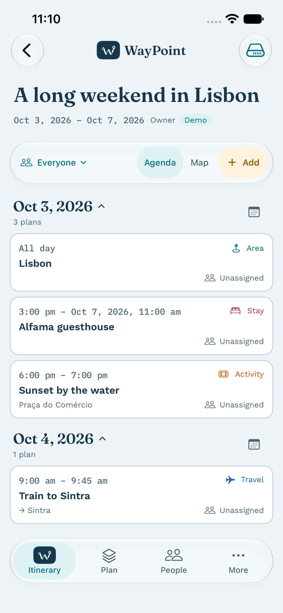
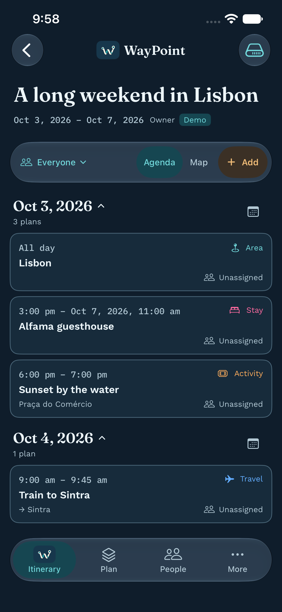

# Floating glass iPhone workspace

8 October 2026

The selected compact-card design is implemented in the native trip workspace. A single scroll view contains the trip name, dates and a section with a pinned action header. The title and dates leave the screen while People, Agenda/Map and Add remain available, including on short itineraries. At accessibility text sizes the action header stacks; the bottom dock retains native navigation scaling and explicit selection and VoiceOver labels.

The bottom dock floats over scrolling content. Scroll content has a bottom margin so the final record can move fully above it. Itinerary uses the original WayPoint image asset, with small system icons for Plan, People and More. Day collapse, expand all and date jump are available from the calendar menu beside a day, without a permanent secondary toolbar or offline tutorial banner. Date-jump targets use the measured pinned-header height and viewport position so their headings stay below the glass controls. A small native anchor uses public UIKit coordinate conversion, avoiding height-dependent fractional alignment on very tall accessibility days.

Cards are solid Atlas surfaces with a 12-point corner radius. They display local times, title, record type, concise venue/arrival context and named people. Notes, full addresses and saved timezone move to a detail sheet. Read-only people can view details. Owner/Admin and contributors with a current matching assignment can open Edit; the editor retains the existing validation, raw record fields and optimistic revision. A refresh removing an assignment revokes contributor editing. Shared filtering and sync behavior are unchanged.

Only navigation and controls use glass. `AtlasGlass` applies the native SwiftUI glass material on iOS 26+, regular material on earlier supported releases, or an opaque surface when Reduce Transparency is enabled. This follows [Apple’s material guidance](https://developer.apple.com/design/human-interface-guidelines/materials) and [glassEffect API](https://developer.apple.com/documentation/swiftui/view/glasseffect(_:in:)). Deployment remains iOS 17. Build with Xcode 26+ for native Liquid Glass; earlier compilers use the regular-material fallback so the existing CI/toolchain remains buildable.

The web app’s Fraunces, Work Sans and IBM Plex Mono fonts are local resources registered through `UIAppFonts`. Each original font and licence is in `WayPointApp/Fonts`, alongside source URLs and SHA-256 hashes in `SOURCES.json`. Xcode project regeneration preserves the font folder, Info.plist and source/test membership. Welcome, login and trip-list headings use the same bundled typefaces; trip-list cards are also smaller. The dark amber colours now match the web palette exactly.

## Native previews

| Light | Dark |
| --- | --- |
|  |  |

## Validation

Validated locally with Xcode 27.0 (27A266a), the iOS 27.0 SDK/runtime and ad hoc simulator signing:

| Check | Result |
| --- | --- |
| Core package regression suite | 45 passed |
| App-hosted fonts, current-assignment permissions, API and account-isolated storage | 13 passed |
| iPhone 17e interface suite | 6 passed |
| iPad mini navigation, details/Edit, login/help and date jumps | 4 passed |
| Dark iPhone navigation/filter/defaults and login/help | 2 passed; native screenshots inspected |
| Simulator build, project regeneration, font/licence hashes, plist/scheme and source diff checks | Passed |

Source whitespace checks exclude the original upstream font licence files; their bytes and recorded hashes are preserved.

The iPhone flows cover compact cards, complete detail sheets, pinned actions after scrolling, people filtering and selected-participant defaults, Map, Plan, People, More, login/help and the largest accessibility text size. Date jumps are checked from both expanded and collapsed days, with the target heading measured below the pinned controls. Native toolbar measurement stays available when the section header leaves SwiftUI’s preference tree.

Authenticated production sync, physical-device acceptance, older-runtime/compiler appearance and the system Reduce Transparency setting remain manual checks. The fallback paths are included but were not run on an older installed runtime. This change does not deploy, migrate, distribute or sign for a physical device.
